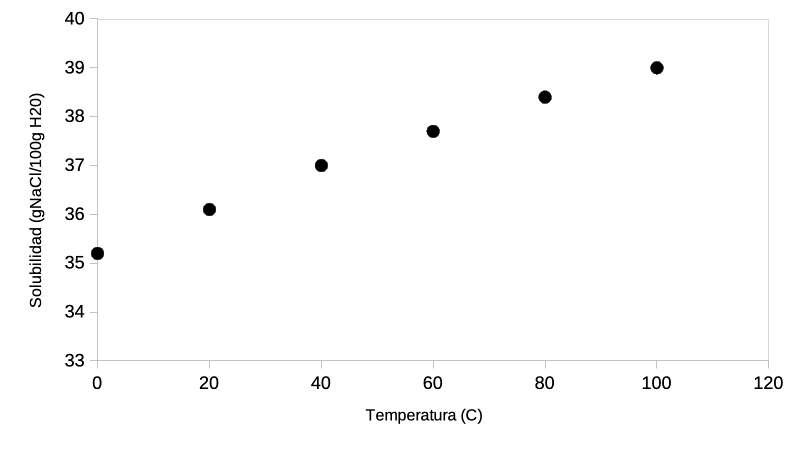
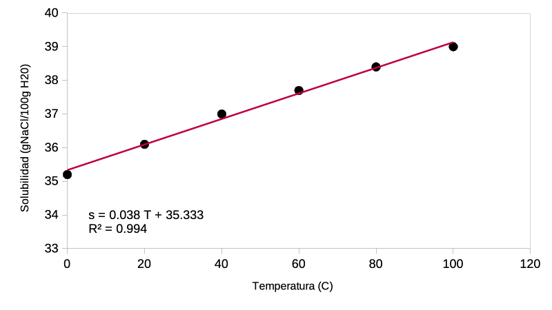
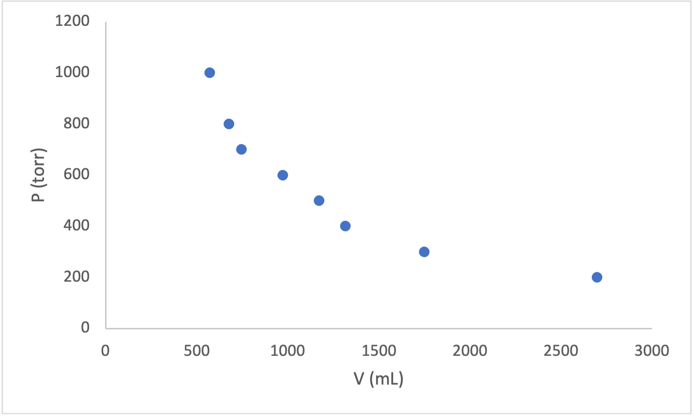
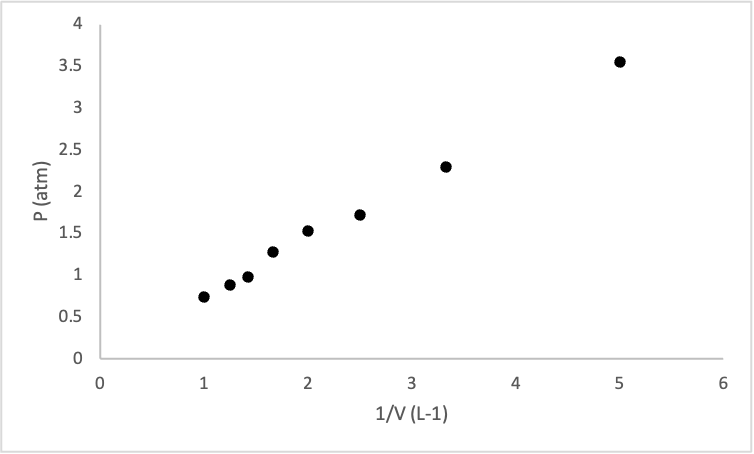
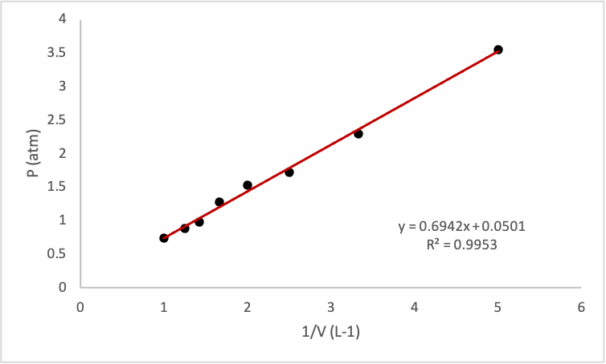

# Introduccion al analisis y representacion de datos para Quimica General e Inorgánica

## La importancia del analisis de datos

Simplificando bastante la cuestion podemos decir que la labor cientifica tiene como partes escenciales las siguientes etapas:

1. Formulacion de Hipotesis.
2. Diseno de experimentos.
3. Recoleccion de datos crudos.
4. Analisis y representacion de datos.
5. Contrastacion de las hipotesis iniciales

Nos centraremos aqui en el punto 4: "Analisis y representacion de datos". En la mayoria de los casos, de los experimentos que se realizan en el laboratorio no se obtienen directamente las respuestas a las preguntas de partida. Aun cuando los experimentos estan bien disenados es necesario tratar los datos crudos obtenidos de manera que puedan ser interpretados y utilizados para la contrastacion de hipotesis.

El tratamiendo de datos por lo general incluye la organización, filtrado y limpieza de los datos crudos; el analisis estadistico de la mismas (obtencion de promedios, desviaciones estandar, exclusion de puntos anomalos, etc); el modelado de los mismos, es decir el tratamiento matematico de los datos aplicando teorias previamente establecidas para la obtencion de distintos parametros; y la representacion gráfica de uno o mas de los pasos anteriores para facilitar la visualizacion y de los resultados obtenidos y la toma de decicion sobre que hacer respecto de nuestras hipotesis de partida.

## Informatica

Existen diversos softwares que poden asistir el tratamiento y la representacion de datos. Es importante destacar que las herramientas informaticas son solo eso, herramientas, y que nunca suplantaran un correcto entedimiento de las teorias necesarias para interpretar los datos obtenidos y sacar conclusiones de los mismos. Sin embargo habiendo dicho esto, es altamente recomendable aprender a usar estas herramientas porque pueden ahorrarnos mucho tiempo y esfuerzo en nuestros projectos. Con ayuda de estos programas pueden hacerse análisis  que serian imposibles de hacer sin el uso de computadoras. La ciencia de datos es una disciplina en auge que aborda todos estos temas, nosotros aca vamos simplemente a dar algunos lineamientos introductorios sobre como analzar conjuntos pequenos de datos, similares a los que podemos obtener durante los trabajos practicos de laboratorio.

El software puede clasificarse en dos grandes categorías considerando el tipo de licencias que posee: privativo o libre.

El software privativo abarca todos los programas con copyright. No puede ser modificado ni compartido y para poder usarlo de manera legal se tiene que poseer una copi original del mismo habiendo adquirido previamente la licencia necesaria para usarlo. Usualmente las licencia del softwate privativo usado en ciencia son muy costosas. Ejemplos de este tipo de software comunmente usados son: 

1. Microsoft Office (Word, Excel y Power Point, para edicion de texto, hojas de calculo y presentaciones)
2. Origin Pro Lab, Graphpad (para analisis y representacion de datos)
3. Photoshop, Illustrator, Corel Draw (para edicion de figuras)
4. Endnote (para gestionar bibliografía)

Aunque existe la posibilidad de usar estos programas de manera ilegal a traves de la instalacion de copias obtenidas por canales diversos, existe otro tipo de software que tiene detras una filosofia de trabajo opuesta al software privativo: el software libre.

El software libre usualmente posee licencia de Copy Left, puede ser compartido libremente y el codigo es de libre acceso para ser estudiado o modificado si es necesario. Ademas, aunque no exclusivamente, la gran mayoria del software libre es tambien gratituito. Estos programas pueden descargarse libremente de los repositorios oficiales y su instalacion y actualizacion suele ser muy sencilla de realizar.

Algunas alternativas a los programas mencionados anteriormente son las siguientes:

1. [Libre Office](https://www.libreoffice.org/) (Writer, Calc, Impress, para edicion de texto, hojas de calculo y presentaciones)
2. [Alpha plot](https://alphaplot.sourceforge.io/), [SciDavies](https://scidavis.sourceforge.net/), [Gnuplot](http://www.gnuplot.info/), [R](https://www.r-project.org/), [Python](https://www.python.org/) (para analisis y representacion de datos)
3. [GIMP](https://www.gimp.org/) and [Inkscape](https://inkscape.org/) (para edicion de figuras)
4. [Zotero](https://www.zotero.org/), [Mendeley](https://www.mendeley.com/) (para gestionar bibliografia)

Todos los programas mencionados en la lista anterior son muy utiles y es recomendable que los chequeen, sin embargo la curva de aprendizaje sobre todo para aquellos que no tienen interfase grafica (R, Python, Gnuplot) puede ser un poco empinada al comienzo. R es uno de los lenguajes de programacion mas usado en todo el mundo para analisis y representacion de datos, en el siguiente [link](https://github.com/foni90mdq/introduccion-a-r.github.io) podran encontrar una introduccion aquellos que estén interesados.

Para los trabajo practicos que desarrollaremos en Quimica General es suficiente con usar la suite Libre Office. Usaremos Calc (programa de hoja de calculo alternativo a Excel) y Writer (programa de hoja de calculo alternativo a Excel).

## Ejemplo 1: Solubilidad

Queremos investigar como varia la solubilidad del NaCl con la temperatura. Se preparan soluciones saturadas de NaCl a distinta temperatura y se mide su concentración. Los datos obtenidos son los que se muestran en la Tabla 1. 

Tabla 1. Solubilidad de NaCl obtenida a distintas temperaturas.

| Muestra | Temperatura (C) | Solubilidad (g NaCl/100 g water) |
| ------- | --------------- | -------------------------------- |
| 1       | 0.00            | 35.2                             |
| 2       | 20.0            | 36.1                             |
| 3       | 40.0            | 37.0                             |
| 4       | 60.0            | 37.7                             |
| 5       | 80.0            | 38.4                             |
| 6       | 100.0           | 39.0                             |

Este ejemplo servira para tener un primer acercamiento a como deben presentarse y analizarse los datos obtenidos. Tanto tablas como figuras deben tener un tiutulo, en las tablas suele ir antes de la tabla, como se mostros en el ejemplo y en las figuras debajo. Siempre deben numerarse (las tablas por un lado, las figuras por otro) y deben estar siempre referidas en el texto, como se hizo en el parrafo anterior. Todas las variables deben escribirse con unidades adecuadas.

Como dijimos antes, queremos ver como varia la solubilidad del NaCl con la temperatura, es decir, queremos ver si existe alguna funcion matematica que relaciones la solubilidad (**s**) con la temperatura (**T**), es decir, queremos encontrar

$s=f(T)$ (1)

Las ecuaciones deben escribirse con un editor de ecuaciones apropiado y deben numerarse para poder referidas en el texto (Eq. 1)

Hay dos variables estudiadas, **T** y **s**. Lasvariables dependientes son las que se miden durante el experimento (**s**) mientras que las Independientes son las que son fijadas *a priori* por el disenio experimental, en este caso, **T**.

Cuando queremos graficar dos variables es usual poner la independiente en el eje x y la dependiente en el eje y como se muestra en la Fig. 1.

Figura 1. Variacion de la solubilidad del NaCl con la temperatura.

En este primer ejemplo pueden verse algunos espectos que es importante tener en cuenta a la hora de hacer una figura para informe o un articulo cientifico. Todas las fiugras (y tambien las tablas) deben tener un titulo (pueden tambien poseer una descripcion breve) y deben estar referidas en el texto de forma similar a como se hizo aqui.

Cuando se presentan graficos en los que queremos mostrar la relacion entre dos variable numericas continuas como en este caso, el tipo mas usual utilizado es el grafico de *dispersión*, en el que cada punto representa uno de los datos obtenidos. Como regla general no deben unirse los puntos con lineas segmentadas. El area donde los datos esta graficados debe ocupar un porcentaje grande del area disponible y la escala de los ejes debe ser adecuada y los mismos deben poseer el nombre de la variable representada con su unidad correspondiente. El tamano de la fuente utilizada para ejes y escalas debe ser apropiada para que puedan leerse con facilidad en el documento terminado.

Como se ve que los datos parecen ajustarse bastante bien a una correcta, podemos hacer una regresion lineal para conocer la funcion lineal que mejor se ajusta a los datosobtenidos. Esta operacion puede hacerse muy facilmente con los programas antes mencionados. En este ejemplo continuaremos usando el Calc de Libre Office (Fig. 2).

Figura 2. Ajuste de regresion lineal (linea roja) sobre los datos de solubilidad obtenidos a distintas temperaturas.

Vemos que el $R^2$ es muy cercano a uno por lo que podemos decir que el ajuste lineal es adecuado. Aunque presentamos la ecuacion y el $R^2$ en la Fig. 2 es adecuado escribir la funcion obtenido como una ecuacion presentada en el cuerpo del texto (Ec. 2).

$s=0.038 T+35.33$ (2)

## Transformaciones de datos y modelado

En algunos casos, de la grafica directa de los datos crudo no puede obtenerse ninguna informacion interesante y es neceasario primero transformar los datos (hacer cuentas) usando modelos (teorias, ecuaciones) conocidas que nos ayuden a transformar las variables en otras que puedan ser representadas graficamente para obtener la informacion buscada.

Veamos el siguiente ejemplo, se quiere calcular empiricamente la constante universal de los gases ($R$). Para eso se estudian 0.03 moles de $N_2$ confinados en un piston con embolo movil en un bano de agua a 25 C. Se comprime el embolo reduciendo el volumen y se mide la presion del gas. La temperatura se mantiene constante durante todo el experimento. Los resultados obtenidos se muestran en la Tabla 2.

Tabla 2. Medidas de presion correspondientes a distintos volumenes para 0.3 mol de $N_2$ a 25 C.

| P(torr) | V(mL) |
| ------- | ----- |
| 570     | 1000  |
| 676     | 800   |
| 745     | 700   |
| 973     | 600   |
| 1170    | 500   |
| 1315    | 400   |
| 1748    | 300   |
| 2698    | 200   |

Graficar P vs V en este caso, no nos sirve para obtener la informacion requerida. Sabemos que para gases a bajas presiones y temperaturas moderas, el modelo del gas ideal es por lo general adecuado. En la Ec. 3 se muestra la ley de estado para un gas ideal.

$PV=RnT$ (3)

Podrian estar tentados a calcular para cada fila con la ecuacion anteriro el valor de R. Debido al error experimental en la medida obtendremos distintos valores de R para cada fila que luego podriamos promediar para obtener un valor de R para toda la experiencia. Sin embargo esto no es lo mejor que podemos hacer.

Podemos reorganizar la Ec. 3 de manera para mostrar la dependencia de la presion con el volumen a T y n constantes (Ec. 4):

$P=\frac{RnT}{V}$ (4)

O lo que es lo mismo (Ec. 5):

$P=RnT\frac{1}{V}$ (5)

En la Ec 4 resulta evidente que la relacion entre P y V no es lineal, un grafico de P vs V lo comprueba (Fig. 3)

Figura 3. Variacion de la presion con el volumen para 0.03 mol de $N_2$ a 25 C.

Sin embargo, la Ec. 5 muestra que P es proporcional a 1/V, es decir que si graficamos P vs 1/V deberiamos obtener puntos que puedan ser ajustados por regresion lineal como hicimos antes.

Antes de proceder vamos a hacer una aclaracion sobre las unidades. El analisis dimensional (estudio de las unidades usadas) es imprescindible para el desarrollo de la actividad cientifica. Debemos tener especial cuidado en utilizar unidades que sean compatibles entre. En este caso particular vemos que la presion fue medida en *torr* y el volumen esta dado en *mL*. Si queremos obtener R con las unidades habituales ($atm L K^{-1 }mol^{-1}$) debemos convertir las presiones a atm y los volumenes a L.

Para hacer este tipo de cálculos (o muchos otros como calculos de inversas, logaritmos, conversion de unidades, etc) que debemos aplicar a un set de datos es altamente recomendable el uso de funciones que pueden ser usadas en las hojas de calculo. Para eso deberemos aprender la sintaxis especifica del software que estemos utilizando. En Excel y en Calc (la hoja de calculo de Libre Office) basta con poner en una celda `=`seguido del nombre de la funcion, a continucacion se muestran un par de ejemplos.

`=average('datos')`para calcular el promedio

`=desvesta('datos')`para calcular la desviacion estandar

`=1/A1`para calcular la inversa de la celda A1

En la Tabla 3 se muestran los valores de las variables en unidades compatibles con las unidades abituales de R

Tabla 3. Variables transformadas con unidades compatibles.

| P(atm) | V(L) | 1/V ($L^{-1}$) |
| ------ | ---- | -------------- |
| 0.75   | 1    | 1.0            |
| 0.89   | 0.8  | 1.3            |
| 0.98   | 0.7  | 1.4            |
| 1.28   | 0.6  | 1.7            |
| 1.54   | 0.5  | 2.0            |
| 1.73   | 0.4  | 2.5            |
| 2.3    | 0.3  | 3.3            |
| 3.55   | 0.2  | 5.0            |

Ahora si graficando P vs 1/v obtenemos el grafico que se muestra en la Fig. 4. Los datos muestran una recta perfecto debido al error experimental. 

Figura 4. Dependecia lineal de P con la inversa del volumen.

La Ec. 5 muestra que luego de obtener la recta que mejor se ajusta a los puntos representados en Fig. 4 puede obtener el valor de R de la siguiente manera:

$R=\frac{m}{nT}$ (6)

Donde $m$ es el valor de la pendiente y n y T son el numero de moles y la temperatura respectivamente.

En la Fig. 5 se muestra el ajuste lineal realizado con el valor de los paramatros obtenidos.

Figura 5. Ajuste lineal realizado sobre datos de variacion de presion y volumen para 0.03 mol de $N_2$ a 25C.

Sustituyendo el valor de la pendiente en la Ec. 5 obtenemos:

$R=0.078 atm L K^{-1} mol^{-1}$ (5)

Las diferencias repecto al valor tabulado para R se deben al error experimental. Estrictamente hablando deberiamos reportar nuestra medida con su intervalo de confianza, pero ese tema escapa al alcance de este articulo. Solamente se quiere ilustrar con este ejemplo como los modelos teoricos pueden ser utilizados para analizar datos experimentales y obtener informacion util para el cientifique.

