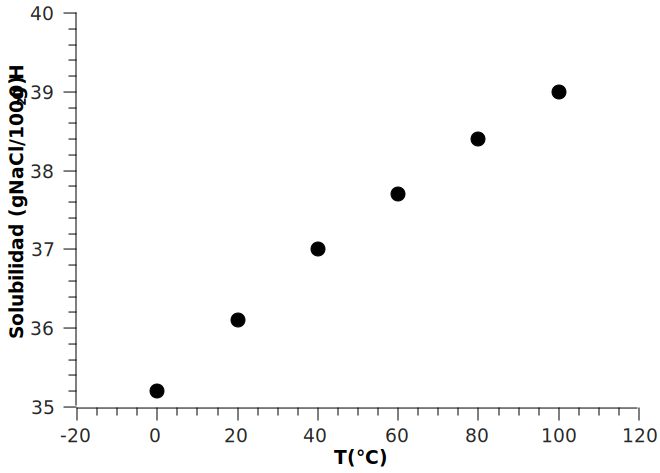
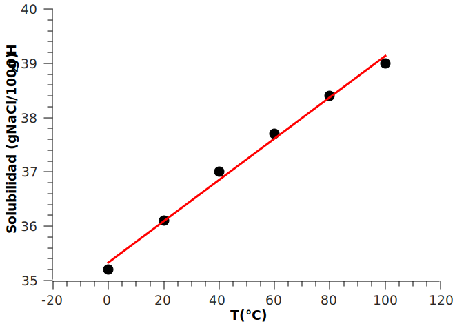
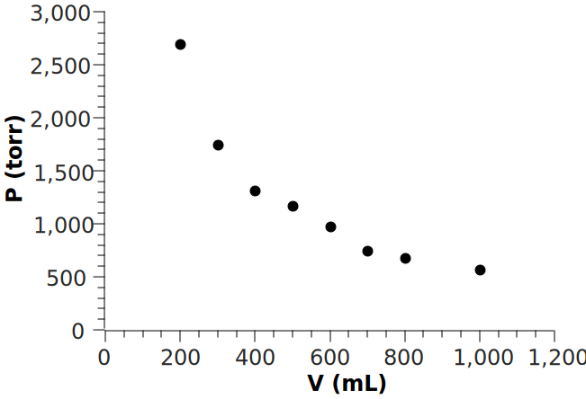
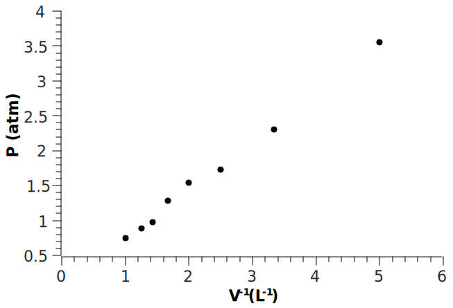
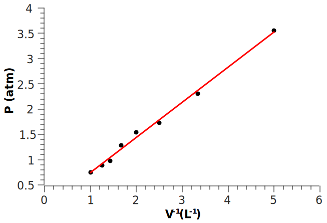

# Introducción al análisis y representación de datos para Química General

## La importancia del análisis de datos

Simplificando bastante la cuestión podemos decir que la labor científica tiene como partes esenciales las siguientes etapas:

1. Formulación de Hipótesis.
2. Diseño de experimentos.
3. Recolección de datos crudos.
4. Análisis y representación de datos.
5. Contrastación de las hipótesis iniciales

Nos centraremos aquí en el punto 4: "Análisis y representación de datos". En la mayoría de los casos, de los experimentos que se realizan en el laboratorio no se obtienen directamente las respuestas a las preguntas de partida. Aún cuando los experimentos estan bien diseñados, es necesario tratar los datos crudos obtenidos de manera tal que puedan ser interpretados y utilizados para la contrastación de hipótesis.

El tratamiendo de datos por lo general incluye la organización, filtrado y limpieza de los datos crudos; el análisis estadístico de los mismos (obtención de promedios, desviaciones estandar, exclusión de puntos anómalos, etc); el modelado, es decir el tratamiento matemático de los datos aplicando teorías previamente establecidas para la obtención de distintos parámetros; y la representación gráfica de uno o más de los pasos anteriores para facilitar la visualización de los resultados obtenidos y la toma de decisión sobre qué hacer respecto de nuestras hipótesis de partida.

## Informática

Existen diversos softwares que pueden asistir el tratamiento y la representación de datos. Es importante destacar que las herramientas informáticas son solo eso, herramientas, y que nunca suplantarán un correcto entedimiento de las teorías necesarias para interpretar los datos obtenidos y sacar conclusiones de los mismos. Sin embargo, habiendo dicho esto, es altamente recomendable aprender a usar estas herramientas porque pueden ahorrarnos mucho tiempo y esfuerzo en nuestros projectos. Con ayuda de estos programas pueden hacerse análisis  que serían imposibles de hacer sin el uso de computadoras. La ciencia de datos es una disciplina en auge que aborda todos estos temas, nosotros acá vamos simplemente a dar algunos lineamientos introductorios sobre cómo analizar conjuntos pequeños de datos, similares a los que podemos obtener durante los trabajos prácticos de laboratorio.

El software puede clasificarse en dos grandes categorías considerando el tipo de licencias que posee: privativo o libre.

El software privativo abarca todos los programas con copyright. No puede ser modificado ni compartido y para poder usarlo de manera legal se tiene que poseer una copia original del mismo, habiendo adquirido previamente la licencia necesaria para usarlo. Usualmente las licencia del softwate privativo usado en ciencia son muy costosas. Ejemplos de este tipo de software comúnmente usados son:

1. Microsoft Office (Word, Excel y Power Point, para edición de texto, hojas de cálculo y presentaciones)
2. Origin Pro Lab, Graphpad (para análisis y representación de datos)
3. Photoshop, Illustrator, Corel Draw (para edición de figuras)
4. Endnote (para gestionar bibliografía)

Aunque existe la posibilidad de usar estos programas de manera ilegal a través de la instalación de copias obtenidas por canales diversos, existe otro tipo de software que tiene detrás una filosofía de trabajo opuesta al software privativo: el software libre.

El software libre usualmente posee licencia de Copy Left, puede ser compartido libremente y el código es de libre acceso para ser estudiado o modificado si es necesario. Además, aunque no exclusivamente, la gran mayoría del software libre es también gratuito. Estos programas pueden descargarse libremente de los repositorios oficiales y su instalación y actualización suele ser muy sencilla de realizar.

Algunas alternativas a los programas mencionados anteriormente son las siguientes:

1. [Libre Office](https://www.libreoffice.org/) (Writer, Calc, Impress, para edición de texto, hojas de cálculo y presentaciones)
2. [Alpha plot](https://alphaplot.sourceforge.io/), [SciDavies](https://scidavis.sourceforge.net/), [Gnuplot](http://www.gnuplot.info/), [R](https://www.r-project.org/), [Python](https://www.python.org/) (para análisis y representación de datos)
3. [GIMP](https://www.gimp.org/) and [Inkscape](https://inkscape.org/) (para edición de figuras)
4. [Zotero](https://www.zotero.org/), [Mendeley](https://www.mendeley.com/) (para gestionar bibliografía)

Todos los programas mencionados en la lista anterior son muy útiles y es recomendable que los chequeen, sin embargo la curva de aprendizaje sobre todo para aquellos que no tienen interfaz gráfica (R, Python, Gnuplot) puede ser un poco empinada al comienzo. R es uno de los lenguajes de programación más usado en todo el mundo para análisis y representación de datos. En el siguiente [link](https://github.com/foni90mdq/introduccion-a-r.github.io) podrán encontrar una introducción aquellos que estén interesados.

Para los trabajo prácticos que desarrollaremos en Química General es suficiente con usar la suite Libre Office. Usaremos Calc (programa de hoja de cálculo alternativo a Excel). También veremos como utilizar el programa SciDavis, una muy buena alternativa libre al Origin Lab. Si bien programas como el Calc o el Excel permiten hacer gráficos que para este nivel son suficientes, SciDavis (al igual que Origin Lab) está específicamente desarrollado para el analisis y la representación de datos científicos, por lo que posee una gran variedad de opciones que no están disponibles en las hojas de cálculo tradicionales. [Aquí](Scidavis.md) podrán encontrar un pequeño tutorial para la instalación y primeros pasos de SciDavis.

## Ejemplo 1: Solubilidad

Queremos investigar como varía la solubilidad del NaCl con la temperatura. Se preparan soluciones saturadas de NaCl a distinta temperatura y se mide su concentración. Los datos obtenidos son los que se muestran en la Tabla 1.

Tabla 1. Solubilidad de NaCl obtenida a distintas temperaturas.

| Muestra | Temperatura (C) | Solubilidad (g NaCl/100 g $H_2O$) |
| ------- | --------------- | -------------------------------- |
| 1       | 0.00            | 35.2                             |
| 2       | 20.0            | 36.1                             |
| 3       | 40.0            | 37.0                             |
| 4       | 60.0            | 37.7                             |
| 5       | 80.0            | 38.4                             |
| 6       | 100.0           | 39.0                             |

Este ejemplo servirá para tener un primer acercamiento a cómo deben presentarse y analizarse los datos obtenidos. Tanto tablas como figuras deben tener un título, en las tablas suele ir antes de la tabla, como se mostró en el ejemplo y en las figuras debajo. Siempre deben numerarse (las tablas por un lado, las figuras por otro) y deben estar siempre referidas en el texto, como se hizo en el párrafo anterior. Todas las variables deben escribirse con unidades adecuadas.

Como dijimos antes, queremos ver cómo varía la solubilidad del NaCl con la temperatura, es decir, queremos ver si existe alguna función matemática que relacione la solubilidad (**s**) con la temperatura (**T**), es decir, queremos encontrar

$s=f(T)$ (1)

Las ecuaciones deben escribirse con un editor de ecuaciones apropiado y deben numerarse para poder referidas en el texto (Ec. 1)

Hay dos variables estudiadas, **T** y **s**. Las variables dependientes son las que se miden durante el experimento (**s**) mientras que las independientes son las que son fijadas *a priori* por el diseño experimental, en este caso, **T**.

Cuando queremos graficar dos variables, es usual que la variable independiente se coloque en el eje x y la dependiente en el eje y, como se muestra en la Fig. 1.

Figura 1. Variación de la solubilidad del NaCl con la temperatura.

En este primer ejemplo pueden verse algunos aspectos importantes a tener en cuenta a la hora de hacer una figura para un informe o un artículo científico. Todas las figuras (y también las tablas) deben tener un título (pueden también poseer una descripción breve) y deben estar referidas en el texto de forma similar a como se hizo aqui.

Cuando se presentan gráficos en los que queremos mostrar la relación entre dos variable numéricas continuas como en este caso, el tipo más usual utilizado es el grafico de *dispersión*, en el que cada punto representa uno de los datos obtenidos. Como regla general no deben unirse los puntos con líneas segmentadas. El área donde los datos están graficados debe ocupar un porcentaje grande del área disponible, la escala de los ejes debe ser adecuada y los mismos deben poseer el nombre de la variable representada con su unidad correspondiente. El tamaño de la fuente utilizada para ejes y escalas debe ser apropiada para que puedan leerse con facilidad en el documento terminado.

Como se ve que los datos parecen ajustarse bastante bien a una recta, podemos hacer una regresión lineal para conocer la función lineal que mejor se ajusta a los datos obtenidos. Esta operación puede hacerse muy fácilmente con los programas antes mencionados (Fig. 2).

Figura 2. Ajuste de regresión lineal (línea roja) sobre los datos de solubilidad obtenidos a distintas temperaturas.word

Vemos que el valor de $R^2=0.999$ es muy cercano a 1, por lo que podemos decir que el ajuste lineal es adecuado. Aunque a veces se presenta la ecuación y el $R^2$ en la Fig. 2, es adecuado escribir la función obtenida como una ecuación presentada en el cuerpo del texto (Ec. 2).

$s=0.038 T+35.33$ (2)

## Transformaciones de datos y modelado

En algunos casos, de la gráfica directa de los datos crudos no puede obtenerse ninguna información interesante y es necesario primero transformar los datos (hacer cuentas) usando modelos (teorías, ecuaciones) conocidos que nos ayuden a transformar las variables en otras, y que puedan ser representadas gráficamente para obtener la información buscada.

Veamos el siguiente ejemplo, se quiere calcular empíricamente la constante universal de los gases ($R$). Para eso se estudian 0.03 moles de $N_2$ confinados en un pistón con émbolo móvil en un baño de agua a 25 C. Se comprime el émbolo reduciendo el volumen y se mide la presión del gas. La temperatura se mantiene constante durante todo el experimento. Los resultados obtenidos se muestran en la Tabla 2.

Tabla 2. Medidas de presión correspondientes a distintos volúmenes para 0.3 mol de $N_2$ a 25 C.

| P(torr) | V(mL) |
| ------- | ----- |
| 570     | 1000  |
| 676     | 800   |
| 745     | 700   |
| 973     | 600   |
| 1170    | 500   |
| 1315    | 400   |
| 1748    | 300   |
| 2698    | 200   |

Graficar P vs V en este caso, no nos sirve para obtener la información requerida. Sabemos que para gases a bajas presiones y temperaturas moderadas, el modelo del gas ideal es por lo general adecuado. En la Ec. 3 se muestra la ley de estado para un gas ideal.

$PV=RnT$ (3)

Podrían estar tentados a calcular para cada fila, utilizando la ecuación anterior, el valor de R. Si hacemos esto, debido al error experimental en la medida obtendremos distintos valores de R para cada fila que luego podríamos promediar para obtener un valor de R para toda la experiencia. Sin embargo, esto no es lo mejor que podemos hacer.

Podemos reorganizar la Ec. 3 de manera para mostrar la dependencia de la presión con el volumen, a T y n constantes (Ec. 4):

$P=\frac{RnT}{V}$ (4)

O lo que es lo mismo (Ec. 5):

$P=RnT\frac{1}{V}$ (5)

En la Ec 4 resulta evidente que la relación entre P y V no es lineal, un gráfico de P vs V lo comprueba (Fig. 3)

Figura 3. Variación de la presión con el volumen para 0.03 mol de $N_2$ a 25 C.

Sin embargo, la Ec. 5 muestra que P es proporcional a 1/V, es decir que si graficamos P vs 1/V deberíamos obtener puntos que puedan ser ajustados por regresión lineal como hicimos antes.

Antes de proceder vamos a hacer una aclaración sobre las unidades. El análisis dimensional (estudio de las unidades usadas) es imprescindible para el desarrollo de la actividad científica. Debemos tener especial cuidado en utilizar unidades que sean compatibles entre sí. En este caso particular vemos que la presión fue medida en *torr* y el volumen está dado en *mL*. Si queremos obtener R con las unidades habituales ($atm L K^{-1 }mol^{-1}$) debemos convertir las presiones a atm y los volúmenes a L.

Para hacer este tipo de cálculos (o muchos otros como cálculos de inversas, logaritmos, conversión de unidades, etc) que debemos aplicar a un set de datos es altamente recomendable el uso de funciones que pueden ser usadas en las hojas de cálculo. Para eso deberemos aprender la sintaxis específica del software que estemos utilizando. En Excel y en Calc (la hoja de calculo de Libre Office) basta con poner en una celda `=`seguido del nombre de la función. A continuación se muestran un par de ejemplos.

`=average('datos')`para calcular el promedio

`=desvesta('datos')`para calcular la desviación estandar

`=1/A1`para calcular la inversa de la celda A1

En la Tabla 3 se muestran los valores de las variables en unidades compatibles con las unidades habituales de R

Tabla 3. Variables transformadas con unidades compatibles.

| P(atm) | V(L) | $V^{-1}$ ($L^{-1}$) |
| ------ | ---- | -------------- |
| 0.75   | 1    | 1.0            |
| 0.89   | 0.8  | 1.3            |
| 0.98   | 0.7  | 1.4            |
| 1.28   | 0.6  | 1.7            |
| 1.54   | 0.5  | 2.0            |
| 1.73   | 0.4  | 2.5            |
| 2.3    | 0.3  | 3.3            |
| 3.55   | 0.2  | 5.0            |

Ahora si, graficando P vs 1/V obtenemos el gráfico que se muestra en la Fig. 4. Los datos no muestran una recta perfecta debido al error experimental.

Figura 4. Dependencia lineal de la presión con la inversa del volumen.

La Ec. 5 muestra que luego de obtener la recta que mejor se ajusta a los puntos representados en la Fig. 4, puede obtenerse el valor de R de la siguiente manera:

$R=\frac{m}{nT}$ (6)

Donde $m$ es el valor de la pendiente, y n y T son el número de moles y la temperatura respectivamente.

En la Fig. 5 se muestra el ajuste lineal realizado con el valor de los parámaeros obtenidos.

Figura 5. Ajuste lineal realizado sobre datos de variación de presión y volumen para 0.03 mol de $N_2$ a 25C.

La pendiente obtenida es $m=0.6942$. Sustituyendo este valor en la Ec. 5 obtenemos:

$R=0.078 atm L K^{-1} mol^{-1}$ (5)

Las diferencias repecto al valor tabulado para R se deben al error experimental. Estrictamente hablando, deberíamos reportar nuestra medida con su intervalo de confianza, pero ese tema escapa al alcance de este artículo. Con este ejemplo solamente se quiere ilustrar cómo los modelos teóricos pueden ser utilizados para analizar datos experimentales y obtener información útil para el científico.
