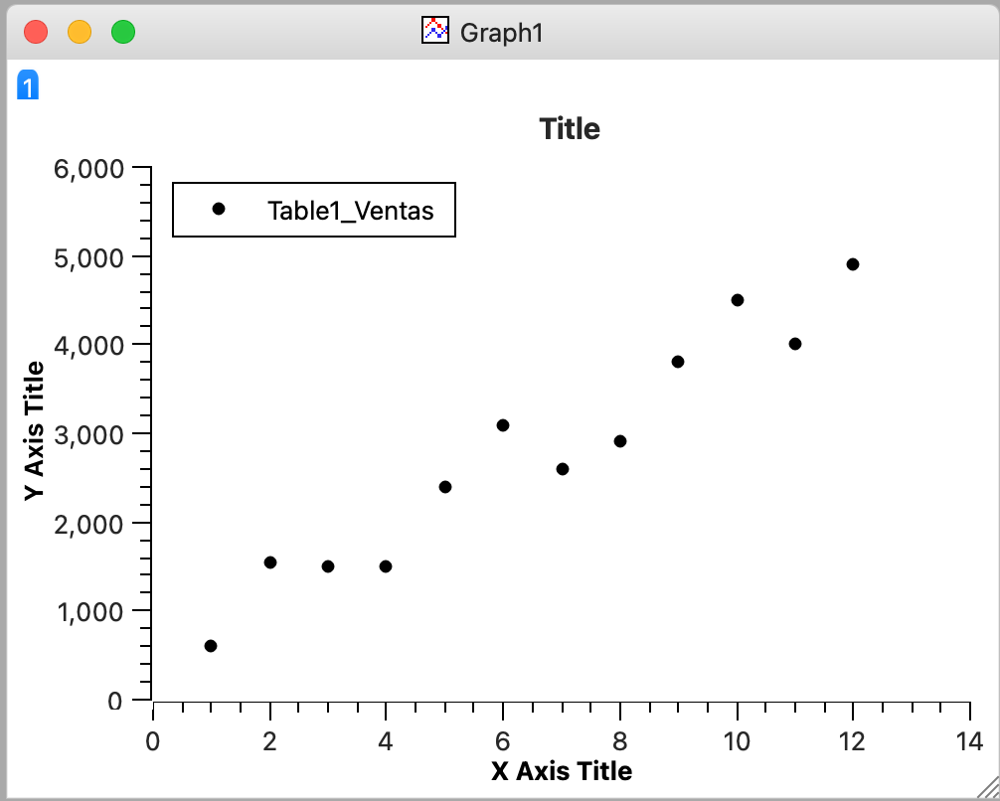
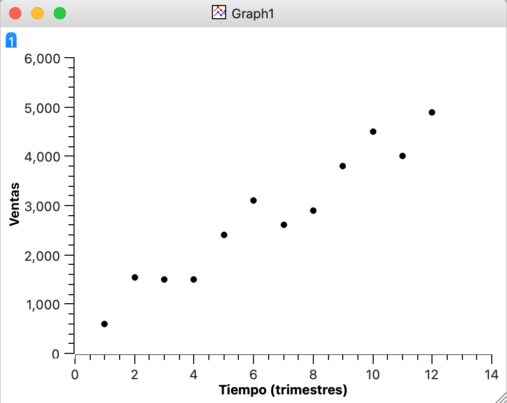
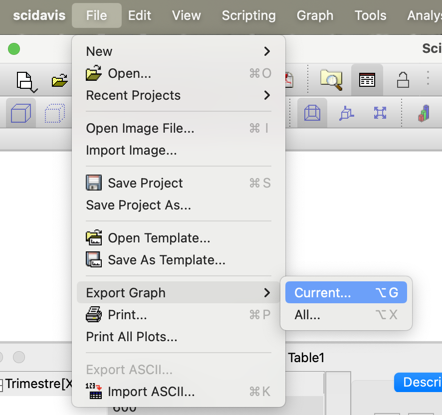
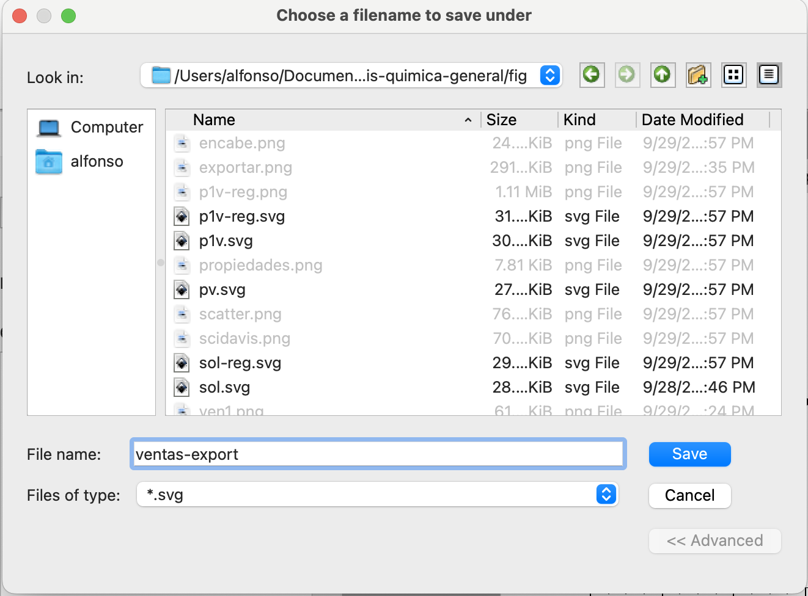
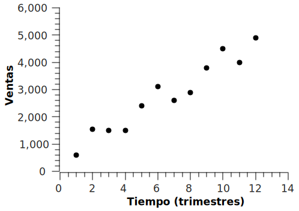
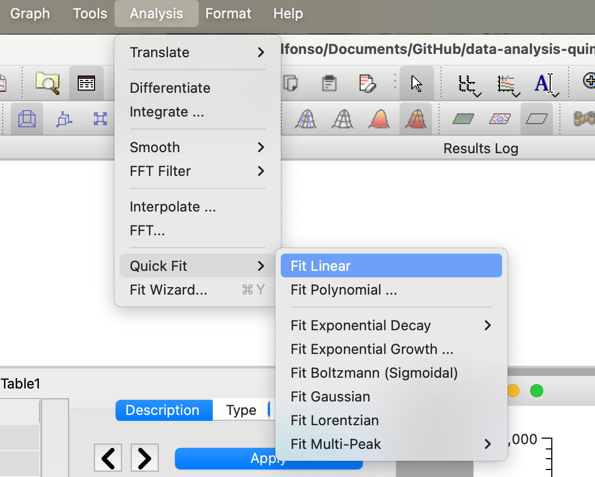
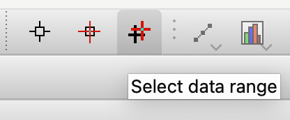
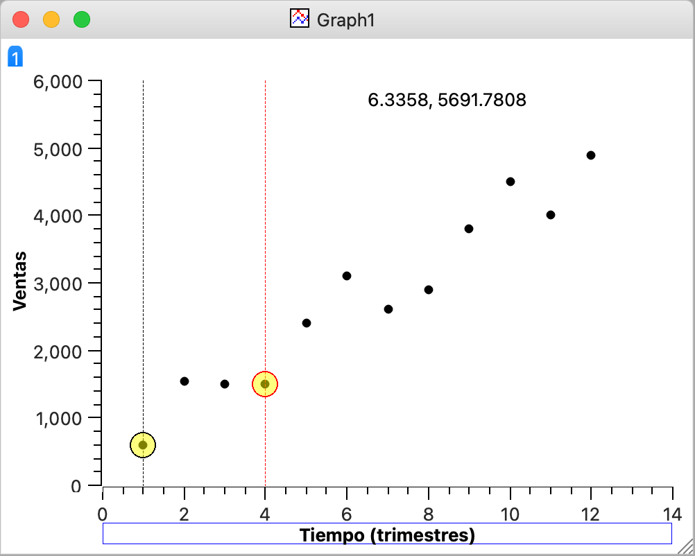
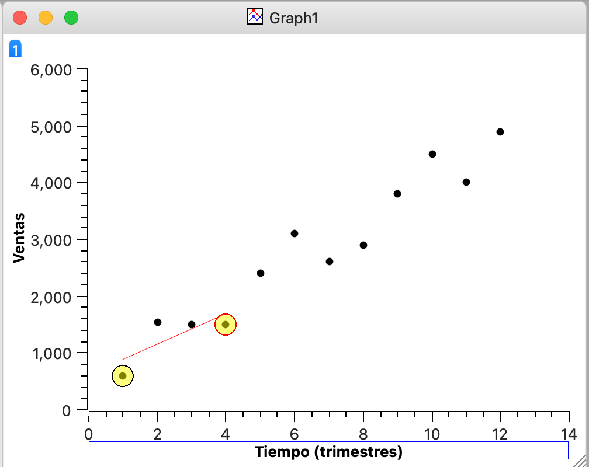

# SciDavis: Instalación y primeros pasos

## Instalación

Como SciDavis es un programa Libre, podemos descargarlo con facilidad y de manera totalmente gratuita desde el siguiente [link](https://sourceforge.net/projects/scidavis/).
Luego de descargarlo sólo debemos hacer doble click sobre el instalador y seguir los pasos indicados por el mismo.

## Primeros pasos

Luego de abrir SciDavis por primera vez nos encontraremos con una pantalla similar a la siguiente:

SciDavis combina una hoja de cálculo similar a Excel con un conjunto de herramientas destinadas al análisis y la representación de datos.
La pantalla está dividida en paneles, donde podemos encontrar la hoja de calculo con un panel de propiedades. 
Los gráficos que creemos irán apareciendo en pantallas nuevas, por otro lado los resultados de los análisis que realicemos aparecerán tambien en un panel de resultados. Todos estos paneles consituyen un ¨projecto¨. Cuando guardemos el trabajo realizado deberemos guardar el projecto completo. Esto generárá un archivo que contendrá dentro los datos y todos los análisis y graficos que hallamos realizado.

## Ingresando datos
Los datos pueden ingresarse a mano o pueden importarse desde otro archivo, dejaremos la importación de archivos para estudiar más tarde.

Ingresemos los datos en la tabla de la siguiente manera:

Podemos cambiar los nombres de las columnas haciendo click en el encabezado de las mismas, tambien podemos editar las propiedades de las columnas en el panel de la derecha:

Debemos mirar con atención el encabezado de las columnas:

Como vemos, hay una columna $[x]$ y otra $[y]$, podemos cambiar esto haciendo click con el boton derecho sobre el encabezado de las columnas y llendo a la opcion "Set column as". SciDavis siempre graficara una o mas columnas $[y]$ respecto de la columna $[x]$ que este a su izquierda. Para hacer un grafico de puntos (dispersion) simple solo basta con seleccionar la o las columnas $[y]$ que queremos graficar (no hace falta seleccionar la columna $[x]$) y luego seleccionamos la opcion "Scatter" en el siguiente panel:

Deberiamos obtener algo como esto:

Todos los campos son editables, usualmente queremos eliminar el titulo porque el titulo lo pondremos debajo de la figura en el manuscrito que estemos escribiend. La leyenda tambien es preferible eliminarla cuando hay 1 sola serie de datos porque es redundante. Tambien debemos poner el titulo adecuado a los ejes con sus unidades:

Para este tutorial solo estamos haciendo capturas de pantalla para obtener las imagenes presentadas, sin embargo para la presentacion de figuras en informes o articulos cientificos debemos exportar las imagenes en un formato adecuado de manera que no luzcan pixeladas en el documento definitivo.

Un formato ampliamente utilizado es PNG (la calidad debe ser suficientemente alta, usualmente >300ppi), sin embargo para gráficos de este tipo es mejor utilizar formatos de imagenes vectoriales (EPS, VSG, PDF), estos formatos permiten el escalo de la imagen sin perdida de resolucion y permite mantener el tamano de los documentos pequenos sin detrimento de la calidad de imagen. Para exportar el grafico anterior debemos ir a export current image (la ventana del grafico que queremos exportar debe estar activa):

Luego debemos elejir el formato adecuado, SVG suele ser una buena opción ya que es compatible con varios editores de texto (como Microsoft Word o Libre office). No puede ser insertado en documentos de Google Docs pero de ser necesario pude ser convertido a PNG de alta resolusion con otros programas como el el servicio en linea [Cloud convert](https://cloudconvert.com/), [ImageMagick](https://imagemagick.org/script/download.php) o [Inkscape](https://inkscape.org/).

 

Luego de elegir el formato adecuado y escribir un nombre ponemos Save y obtendremos nuestra image de buena calidad:

Podemos tambien hacer una regresion lineal, para eso debemos tener el grafico en cuestion como ventana activa, luego debemos hacer click en "fit linear" en:

y obtendremos lo siguiente:

En el panel superior "Results log" podremos ver el resultado de la regesion linea, alli podremos encontrar los valores de la pendiente y la ordenada al origen. En nuestro grafico aparecio la recta de regresion en color rojo, podemos cambiar el espesor, el color y muchas otras opciones haciendo click con el boton derecho sobre la linea roja.

En ciertas ocaciones no queremos usar todos los puntos del grafico para hacer la regresion, supongamos que solo queremos usar los cuatro primeros puntos, debemos usar para esto la opcion "select data range":

Luego en el area del grafico movemos los circulos amarillos para abarcar el rango deseado, primero debe moverse un criculo y luego con las flechas de direccion del teclado hay que seleccionar el otro circulo y hacer lo mismo:

Si hacemos nuevamente la regresion obtendremos lo siguiente:

