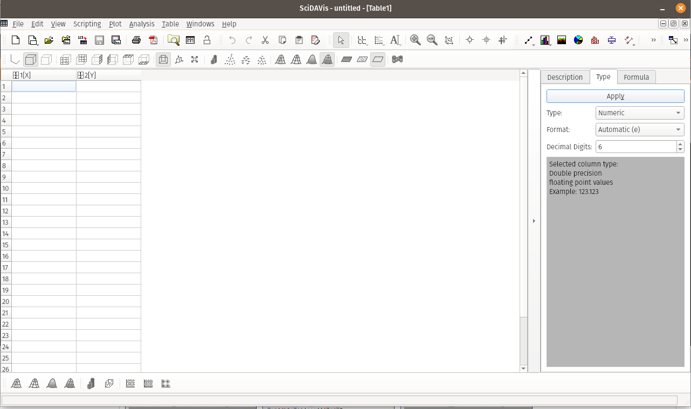
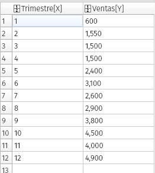
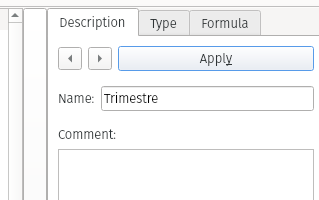
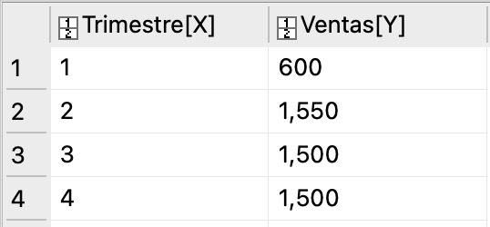
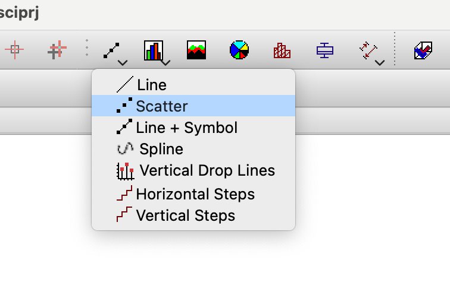

# SciDavis: Instalación y primeros pasos

## Instalación

Como SciDavis es un programa Libre, podemos descargarlo con facilidad y de manera totalmente gratuita desde el siguiente [link](https://sourceforge.net/projects/scidavis/).
Luego de descargarlo sólo debemos hacer doble click sobre el instalador y seguir los pasos indicados por el mismo.

## Primeros pasos

Luego de abrir SciDavis por primera vez nos encontraremos con una pantalla similar a la siguiente:

SciDavis combina una hoja de cálculo similar a Excel con un conjunto de herramientas destinadas al análisis y la representación de datos.
La pantalla está dividida en paneles, donde podemos encontrar la hoja de calculo con un panel de propiedades. 
Los gráficos que creemos irán apareciendo en pantallas nuevas, por otro lado los resultados de los análisis que realicemos aparecerán tambien en un panel de resultados. Todos estos paneles consituyen un ¨projecto¨. Cuando guardemos el trabajo realizado deberemos guardar el projecto completo. Esto generárá un archivo que contendrá dentro los datos y todos los análisis y graficos que hallamos realizado.

## Ingresando datos
Los datos pueden ingresarse a mano o pueden importarse desde otro archivo, dejaremos la importación de archivos para estudiar más tarde.

Ingresemos los datos en la tabla de la siguiente manera:

Podemos cambiar los nombres de las columnas haciendo click en el encabezado de las mismas, tambien podemos editar las propiedades de las columnas en el panel de la derecha:

Debemos mirar con atención el encabezado de las columnas:

Como vemos, hay una columna $[x]$ y otra $[y]$, podemos cambiar esto haciendo click con el boton derecho sobre el encabezado de las columnas y llendo a la opcion "Set column as". SciDavis siempre graficara una o mas columnas $[y]$ respecto de la columna $[x]$ que este a su izquierda. Para hacer un grafico de puntos (dispersion) simple solo basta con seleccionar la o las columnas $[y]$ que queremos graficar (no hace falta seleccionar la columna $[x]$) y luego seleccionamos la opcion "Scatter" en el siguiente panel:

